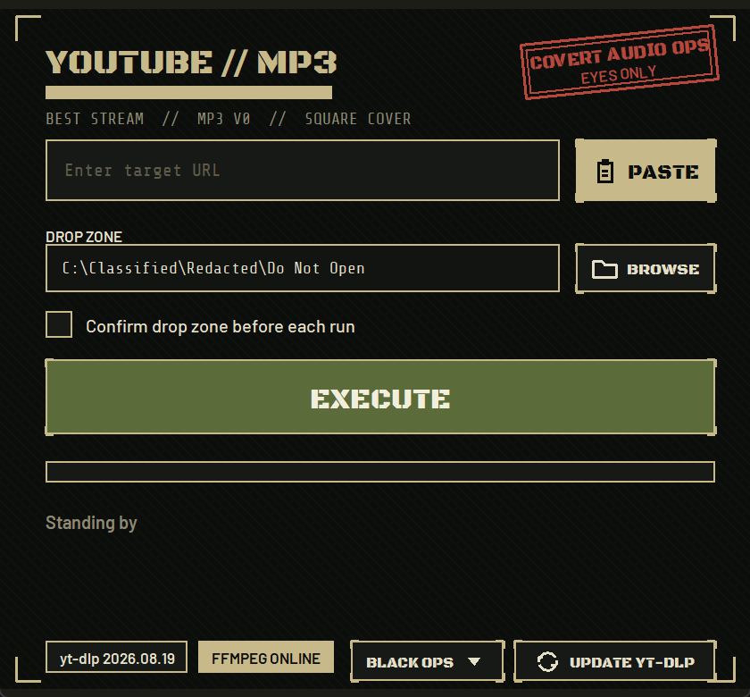
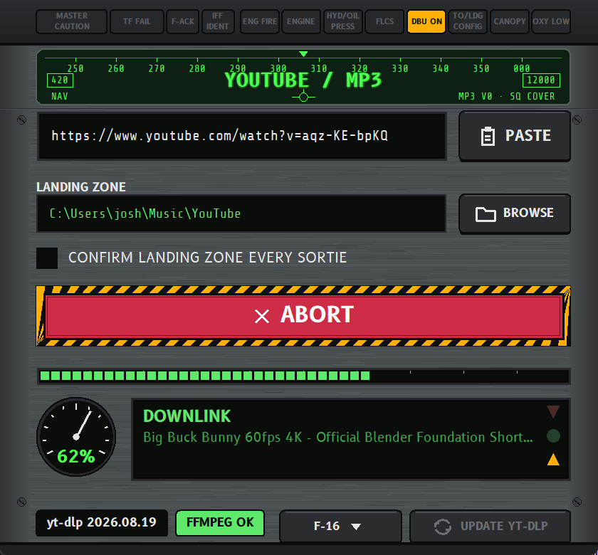
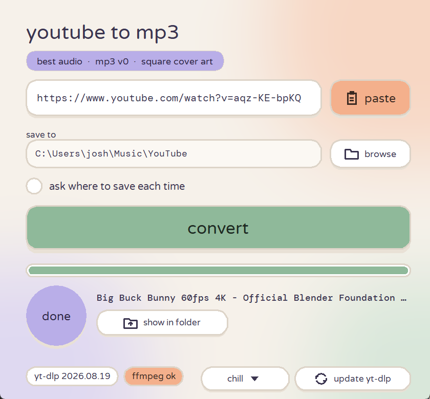
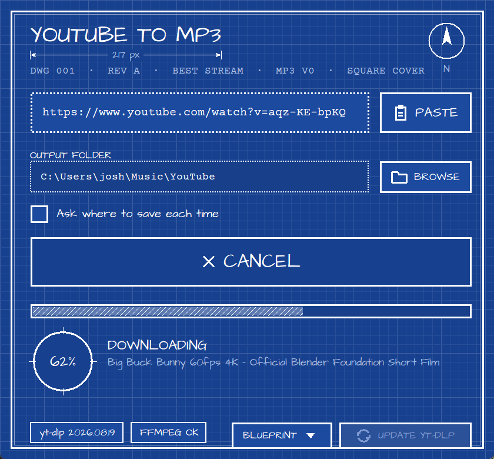

# YouTube to MP3

A small Windows app. Paste a YouTube link, click Convert, get an MP3 with the title, artist and a square cover image already tagged.


It pulls the best audio stream YouTube has, encodes it to MP3 at LAME V0 (about 245 kbps VBR, transparent for any source YouTube serves), crops the 16:9 thumbnail to a square and embeds it as cover art. No re-encoding tricks, no ads, no browser extension.

## Download

Grab `YouTubeToMP3.exe` from the [latest release](../../releases/latest). It needs FFmpeg. Either install FFmpeg and put it on your PATH, or drop `ffmpeg.exe` in the same folder as the app. The footer of the app tells you whether it found one.

Windows SmartScreen will warn on first run because the exe isn't code-signed. Click "More info", then "Run anyway".

## Using it

1. Paste a link. The Paste button reads your clipboard.
2. Pick a folder with Browse, or tick "Ask where to save each time".
3. Convert. The button turns into Cancel while it runs.

YouTube changes things often and yt-dlp, the downloader inside, has to keep up. When downloads start failing with a 403 or "Sign in to confirm", you need a newer yt-dlp. In the exe, press Get Update in the footer and grab the latest release. Running from source, the same button runs pip for you; restart the app afterwards. That fixes it nine times out of ten.

Settings are stored in `%LOCALAPPDATA%\YouTubeToMP3\config.json`. The optional `ffmpeg_location` key points at an FFmpeg folder or exe if you don't want it on PATH.

## Skins

Five looks, one layout. Pick one from the dropdown in the footer and it sticks.

| | |
|---|---|
|  |  |
|  |  |

Pop Art is the default. Black Ops goes covert: hatch texture, corner brackets, a stamped EYES ONLY. F-16 is a Block 50 cockpit: the real eyebrow warning labels across the glareshield, a phosphor-green HUD with a heading tape that drifts and a flight path marker that bobs, DED-green fields, keypad buttons, a hazard-striped ENGAGE lens, an MFD status screen with the AOA indexer, and a round engine gauge for progress. The lights mean things: MASTER CAUTION on an error, FLCS when FFmpeg is missing, DBU ON while a job runs, CANOPY when the folder prompt is armed. Chill is pastel, rounded and lowercase. Blueprint is a drafting sheet with a dimension line under the title and a north arrow, because why not.

Skins live in `skins.py`. One owns its palette, fonts, copy, background image and the shapes the app draws with, so adding a sixth is one class.

## Running from source

```
pip install -r requirements.txt
python youtube_to_mp3.py
```

Python 3.11 or newer. When run from source the config file sits next to the script.

The UI is a single Tk canvas, no widget toolkit. The fonts in `fonts/` (Archivo Black, Space Grotesk, Space Mono) are loaded for the process at startup and never installed. All three are under the SIL Open Font License, copies included.

## Building the exe

```
pip install pyinstaller
.\build.ps1
```

The exe lands in `dist\`. Put an `icon.ico` next to the script before building if you want a custom icon.

## Playlists

Not supported yet. A link that carries both a video id and a list id downloads just the video. A bare playlist link downloads everything in it, one after another, which is probably not what you want.
